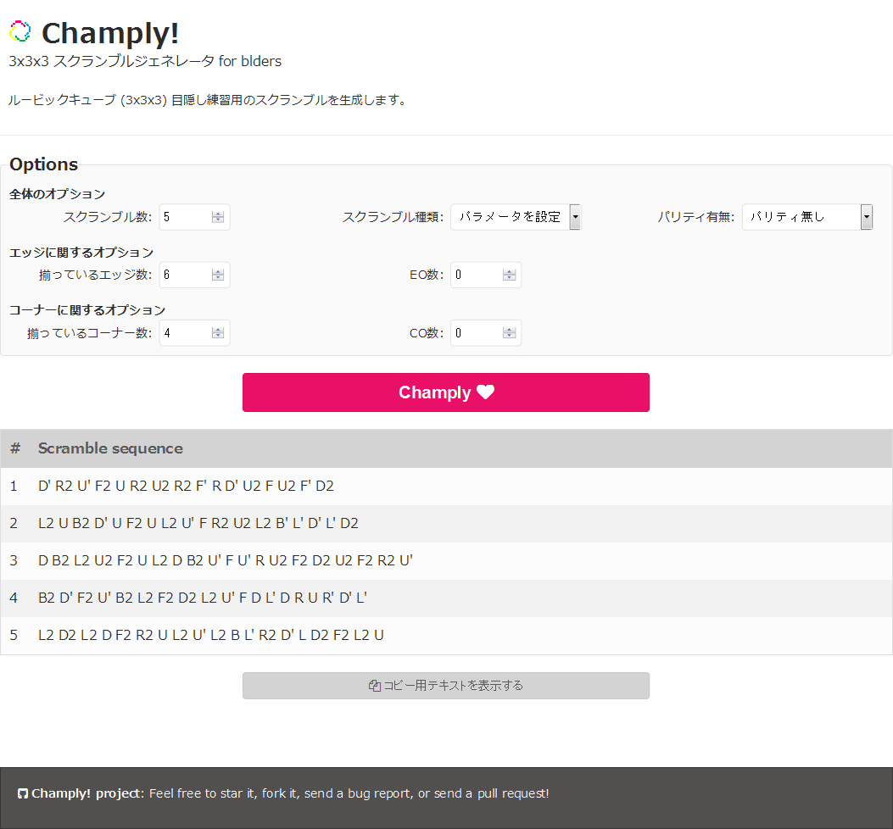

# Champly!

Champer! is a web applicition providing Rubik's cube scrambles (3x3x3) for BLDer.
This is a web interface of 3x3x3 scrambler/solver [chample](https://github.com/kotarot/chample).

## How to build HTML

`champly.html` is an HTML file already generated.
If you would like to generate your own HTML, do the followings.

Python (+Jinja2) need to be installed.
Write settings in `genhtml.py` and then excute the script:
```
python genhtml.py > index.html
```


## Demo

* [http://www.example.net/champly/champly](http://www.example.net/champly/champly)

Screenshot:

